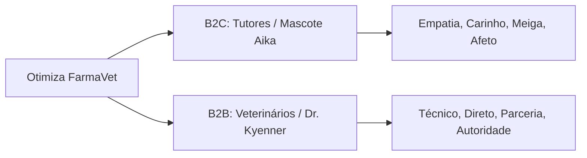

# Brand Book e Manual de Operações Otimiza FarmaVet
## O Guia Definitivo de Identidade, Operações, Catálogo, Compliance e Comercial

Este documento consolida a alma institucional da **Otimiza FarmaVet** e define todas as diretrizes operacionais, comerciais, regulatórias e de atendimento. Ele serve como o guia absoluto para a estagiária, a equipe de marketing e as Inteligências Artificiais da empresa.

---

# SEÇÃO 1: PERFIL INSTITUCIONAL E IDENTIDADE DA MARCA

A **Otimiza FarmaVet** não é um pet shop generalista. Somos uma **Farmácia Veterinária Especialista e de Conveniência** focada em soluções clínicas e de alto valor (High-Ticket). 

## 1. Missão, Visão e Valores
*   **Missão:** Proteger a saúde e prolongar a vida dos animais com agilidade logística, procedência absoluta de medicamentos e atendimento veterinário humanizado.
*   **Visão:** Ser a farmácia veterinária líder e referência em Belo Horizonte (BH) e região metropolitana, reconhecida pela eficiência técnica e pelo acolhimento emocional.
*   **Valores:** "Atendimento como Arte", Transparência Regulatória, Segurança Clínica, Rigor Científico e Parceria Mútua com Médicos Veterinários.

## 2. A Identidade Dual da Marca (As Personas)

Nossa comunicação é Omnichannel e segmentada por duas personas de tom de voz opostos, porém complementares:

### A. Persona B2C: Aika (A Mascote Guardiã)
*   **Voz:** Empática, meiga, carinhosa, que transmite afeto e acolhimento.
*   **Sentimento Primário:** Cuidado e alívio da dor do tutor.
*   **Regra de Ouro:** Proibido usar termos formais ou robóticos como *"Prezado"* ou *"Senhor/Senhora"*. Use o nome do tutor e o nome do pet (ex: *"Oi, Vander! Tudo bem por aí? E como está o Spock?"*).

### B. Persona B2B: Dr. Kyenner (O Diretor Veterinário)
*   **Voz:** Técnica, científica, direta, respeitosa e colaborativa.
*   **Sentimento Primário:** Autoridade e parceria operacional.
*   **Regra de Ouro:** Sem emojis infantis. A comunicação deve ser focada em resolver o problema do médico veterinário com rapidez extrema (cotação rápida, dosagens, lotes clínicos, entrega expressa).

---

# SEÇÃO 2: PERFIL DO CLIENTE IDEAL (ICP)

## 1. ICP B2C: O Tutor Protetor ("Pai/Mãe de Pet")
*   **Perfil:** Homens e mulheres de 25 a 60 anos, classe média-alta/alta, residentes em BH e Nova Lima. Consideram o pet como um filho.
*   **Motivações:** Garantir a longevidade do pet, evitar o sofrimento do animal e sentir-se um cuidador exemplar perante seu círculo social.
*   **Dores Principais:** Medo de comprar medicamentos falsificados na internet, falta de estoque em situações de urgência e frustração com a demora de grandes marketplaces (Petlove, Cobasi).

## 2. ICP B2B: O Médico Veterinário Cadastrado
*   **Perfil:** Veterinários clínicos de atendimento domiciliar, cirurgiões autônomos e donos de clínicas/consultórios veterinários em BH.
*   **Motivações:** Reduzir custos de estoque clínico, ter um fornecedor de vacinas extremamente confiável e ganhar agilidade no dia a dia.
*   **Dores Principais:** Tutores que compram medicamentos errados na internet, distribuidores que exigem pedidos mínimos gigantes e atrasos na entrega de vacinas urgentes.

---

# SEÇÃO 3: MATRIZ DE OBJEÇÕES E PSICOLOGIA DO CLIENTE

| Objeção do Cliente | Tipo de Cliente | Força Emocional por Trás | Script de Contorno Recomendado |
| :--- | :--- | :--- | :--- |
| **"Não quero passar meu CPF no WhatsApp por segurança."** | B2C (Tutor) | Desconfiança e medo de fraude de dados. | *"Compreendo sua preocupação, [Nome]! Nós somos uma farmácia regulada e usamos esses dados para registrar a garantia e o histórico de saúde do [Pet] no pós-venda. Mas fique super à vontade: você pode fazer o pagamento e retirar pessoalmente no nosso escritório na Av. Abílio Machado, 514, Sala 08. Aproveitamos para passar um café fresquinho! O que acha?"* |
| **"O frete está muito caro para a minha região."** | B2C ou B2B | Sensação de perda financeira (zona de conforto). | *(Se 1ª Compra)*: *"Como é sua primeira compra com a gente, eu vou zerar o seu frete hoje (Grátis)! Nas próximas, tentamos colocar na rota da manhã para ficar bem mais em conta, tá?"*  *(Recorrente)*: *"Entendo, [Nome]! O que acha de incluirmos um petisco funcional ou aproveitarmos o desconto de lote do Librela? Assim o envio compensa muito mais!"* |
| **"Meu limite diário de Pix estourou hoje."** | B2B (Veterinário) | Frustração operacional com limites bancários. | *"Sem problemas, Dr.! Para não travar sua rotina, você pode fazer o agendamento do Pix para amanhã bem cedo e me mandar o comprovante de agendamento aqui. Já deixo seu pedido separado na rota das 09:00!"* |
| **"Na internet/concorrência achei mais barato."** | B2C (Tutor) | Desejo de economia financeira básica. | *"Eu entendo perfeitamente, [Nome]. Porém, medicamentos especiais exigem transporte térmico e procedência rígida. Comprando na Otimiza, você tem 100% de garantia de origem direto da distribuidora oficial e ainda conta com nosso suporte veterinário gratuito no WhatsApp para tirar dúvidas de dosagem. Vale o risco de comprar em marketplaces genéricos?"* |

---

# SEÇÃO 4: CATÁLOGO COMPLETO DE PRODUTOS E SERVIÇOS

## 1. Medicamentos Especiais e de Alto Ticket (High-Ticket)

### Librela (Uso Contínuo / Dores Crônicas)
*   **Indicação:** Controle da dor associada à osteoartrite em cães.
*   **Regra Comercial B2C:** R$ 380,00 por ampola. **Promoção de Lote:** Comprando **duas unidades**, cada ampola sai por **R$ 350,00** (R$ 700,00 total). Exige receita simples.
*   **Regra Comercial B2B (Veterinários):** Valor com desconto de atacado direto no sistema. Sem exigência de receita.

### Cytopoint (Controle de Coceira / Dermatologia)
*   **Indicação:** Tratamento da dermatite atópica em cães.
*   **Regra:** Exige receita para tutores. Consultar preços conforme dosagem (mg) no sistema Shopify da loja.

### Metilforan (Tratamento Renal Especial - Campanha de Alta Saída)
*   **Apresentações:** Caixas com 30, 60 e 90 comprimidos.
*   **Regra Exclusiva B2C:** Na compra de **qualquer Metilforan**, o tutor ganha como bonificação:
    *   **1 caixa de Dom Peridona** (grátis)
    *   **1 caixa de Alopurinol** (grátis)
*   **Regulação:** Exige receita oficial do **MAPA (Ministério da Agricultura e Pecuária)**.
*   **Forma de Pagamento Especial:** Parcelamento em até **8x sem juros**.

### Antiparasitários de Destaque
*   **Simparic (10mg ou outras dosagens):**
    *   Caixa com 1 comprimido: R$ 104,50.
    *   Caixa com 3 comprimidos (proteção completa por 3 meses): R$ 269,90.
*   **Bravecto, Nexgard, Credeli:** Consultar valores atualizados no sistema.
*   *Matriz de Equivalência Autorizada:* Se o Bravecto estiver indisponível, a estagiária/IA pode oferecer Simparic ou Nexgard correspondente (sempre perguntando o peso exato do pet).

---

## 2. Serviços Veterinários Domiciliares (Vet em Casa)

Todos os atendimentos domiciliares são eletivos e realizados pelo Dr. Kyenner Oliver.

| Serviço Veterinário | Valor (R$) | Notas Operacionais |
| :--- | :--- | :--- |
| **Consulta Eletiva / Rotina** | R$ 200,00 | Check-up geral do animalzinho no domicílio |
| **Consulta de Orientação** | R$ 200,00 | Orientações de manejo e cuidados preventivos |
| **Consulta de Comportamento Canino** | R$ 200,00 | Análise comportamental e treinos básicos |
| **Vacina Antirrábica** | R$ 60,00 | Preço por dose aplicada |
| **Vacina Multiviral (V8 / V9)** | R$ 70,00 | Preço por dose aplicada |
| **Vacina V10** | R$ 80,00 | Preço por dose aplicada |
| **Vacina de Gripe** | R$ 90,00 | Preço por dose aplicada |
| **Vacina de Giardia** | R$ 97,00 | Preço por dose aplicada |
| **Coleta de Sangue Completa** | R$ 300,00 | Hemograma + Bioquímico + Doença de Carrapato |

### Regra de Deslocamento (Frete do Vet):
*   O valor de deslocamento do veterinário é cobrado à parte e calculado com base no **CEP completo** do cliente.
*   **Instrução:** Pergunte sempre o CEP antes de fechar o agendamento.

---

# SEÇÃO 5: DIRETRIZES DE OPERAÇÃO E LOGÍSTICA

## 1. Rotina Diária da Estagiária (Passo a Passo)

*   **08:30 - Checagem Inicial:**
    1.  Ligar o painel de atendimento (`LIGAR_PAINEL.bat`).
    2.  Verificar a conexão do WhatsApp (`AUTENTICAR_WHATSAPP_AIKA.bat`).
    3.  Confirmar se a automação de Status (`RODAR_STATUS_WHATSAPP_10H.bat`) rodou corretamente para postar os flyers do dia.
    4.  Responder a todas as mensagens acumuladas da noite anterior.
*   **11:00 - Fechamento de Pedidos da Manhã:**
    1.  Reunir todos os Pix confirmados e emitir ordens de separação física.
    2.  Chamar Uber Moto/99App para as entregas e registrar dados de rastreamento.
*   **14:00 - Prospecção Ativa B2B:**
    1.  Realizar disparos das ofertas de vacinas/controlados do dia para a lista de veterinários parceiros.
*   **16:00 - Cobrança de Orçamentos Pendentes:**
    1.  Entrar em contato com clientes que receberam o espelho de pedido mas não enviaram o comprovante Pix: *"Oi, tudo bem? Consigo confirmar o seu pedido para incluir na rota de entregas da tarde?"*
*   **17:30 - LTV e Fechamento:**
    1.  Cadastrar reativações de uso contínuo (recompra) no sistema.
    2.  Deixar organizados os pedidos programados para o dia seguinte pela manhã.

---

## 2. Protocolo de Envio e Rastreio Logístico

Ao despachar qualquer entrega via Uber Moto ou 99App, a estagiária deve enviar a seguinte mensagem estruturada para que o cliente se sinta seguro e acompanhe o entregador:

> 🛵 **Template de Rastreio:**
> *"Seu pedido já foi despachado! Estou utilizando o serviço de entrega moto.*
> 
> 👤 *Motorista:* **[NOME DO MOTORISTA]**
> 🛵 *Placa da moto:* **[PLACA]**
> 🔑 *Código de Segurança:* **[PIN DO APP]**
> 
> *Acompanhe a rota dele em tempo real por este link:* **[LINK DE RASTREIO]**
> 
> *Por favor, informe a pessoa que vai receber sobre o código de segurança para liberar a entrega rápida."*

---

## 3. Safety Net (Gatilho de Transbordamento Humano)

A IA de atendimento deve transferir a conversa imediatamente para o Dr. Kyenner (Kiki) nas seguintes situações de exceção:
1.  **Reclamação ou Irritação:** Palavras como *"atrasado"*, *"errado"*, *"quero cancelar"*, *"insatisfeito"*.
2.  **Urgência Clínica:** Sintomas graves como convulsões, intoxicação, sangramentos (nunca tente tratar ou dar diagnósticos).
3.  **Urgência de Veterinário (B2B):** Pedidos expressos de clínicas (ex: *"Preciso de 3 ampolas para agora"*). A IA recua e notifica a equipe para chamar a moto em menos de 10 minutos.

---

# SEÇÃO 6: COMPLIANCE E REGULAÇÃO VETERINÁRIA

A Otimiza FarmaVet preza pela legalidade absoluta de sua operação técnica:

1.  **Exigência de Receitas (MAPA e CRMV):**
    *   **Tutores (B2C):** É **obrigatório** solicitar a foto ou PDF da receita veterinária assinada para medicamentos controlados (como Metilforan, que exige receita do MAPA) e de alta complexidade (Librela e Cytopoint).
    *   **Veterinários (B2B):** Isentos de apresentação de receita para uso próprio em estoque clínico ou cirúrgico, desde que possuam cadastro de CRMV ativo e validado no sistema.
2.  **Não Exposição Pública de Preços de Vacinas:**
    *   As vacinas e medicamentos injetáveis **não devem ter seus preços exibidos de forma aberta e pública** no site ou em redes sociais devido às regras de fiscalização profissional do CRMV-MG. O preço deve ser informado de forma consultiva e direta no WhatsApp (privado).
3.  **Proibição de Venda de Vacinas para Tutores:**
    *   É terminantemente proibido vender vacinas soltas (injetáveis) para tutores (B2C) aplicarem por conta própria. A vacinação deve ser realizada em domicílio pelo Dr. Kyenner (Vet em Casa) ou em clínicas parceiras.
4.  **Matriz de Não Manipulação (Recusa Empática):**
    *   Não fazemos medicamentos manipulados. Se o tutor solicitar, utilize a frase obrigatória de recusa:
    *   *"Oi [Nome]! Agradecemos o contato. No momento nós não realizamos manipulação de medicamentos, mas desejamos melhoras rápidas para o [Pet]! Que ele fique bem logo — estamos na torcida aqui com muita energia positiva! 🐾"*

---

# SEÇÃO 7: POLÍTICAS COMERCIAIS

1.  **Frete Grátis de Boas-vindas:** Válido exclusivamente para a **primeira compra** de clientes B2C em Belo Horizonte e região de Nova Lima.
2.  **Taxa do Cartão de Crédito:** Aceitamos cartões em link de pagamento ou maquininha física (retiradas), mas a taxa operacional da transação é repassada integralmente ao cliente. **Sempre avise antes de faturar.**
3.  **Descontos em Lote de Librela:** Ampola individual por R$ 380,00. A partir de 2 unidades, o valor cai para R$ 350,00 por ampola.
4.  **Chave PIX Única:** Telefone `(31) 98793-6822` (Banco C6 Bank, Solução Farmacêutica). Nunca forneça chaves de CPFs ou contas pessoais.
5.  **Campanhas de Sorteios:** Compras acima de R$ 150,00 dão direito a participar de sorteios mensais ou sazonais promovidos pela marca (ex: massagens, liberação miofascial no bairro Horto/BH).
