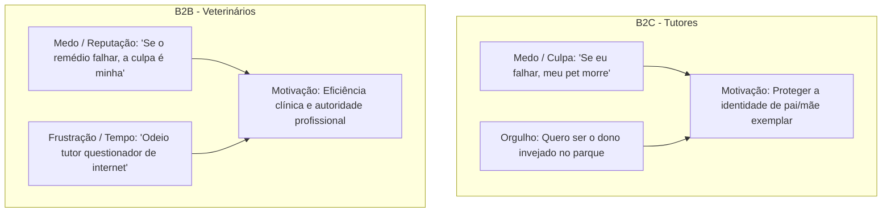

# A Jornada Emocional do Cliente: Ativação de Desejo via Emoções Humanas
*Otimiza FarmaVet / Solução Farmacêutica & Vet em Casa*

Este documento traça o mapa psicológico profundo do nosso cliente, analisando as forças emocionais subconscientes que determinam a compra, tanto para **Tutores (B2C)** quanto para **Médicos Veterinários (B2B)**. 

O objetivo é orientar a estagiária e a IA de suporte a transformarem cotações frias em **fechamentos inevitáveis**, ativando os gatilhos emocionais corretos (medo/culpa, orgulho/status, alívio e raiva/conformidade).

---

## 🧠 1. As Forças Emocionais Dominantes (O Motor da Compra)

Ao vender medicamentos e vacinas veterinárias, **nós não vendemos caixas de remédios; nós vendemos a manutenção de uma identidade e a remoção de uma dor emocional.**

---

## 🐈 2. A Jornada Emocional do Tutor (B2C - Aika)

A jornada do tutor é movida por um ciclo que vai da **ansiedade aguda** ao **alívio acolhedor**.

| Etapa da Jornada | Estado Emocional | A Motivação Oculta | Como Despertar o Desejo (Gatilho) | Script Prático de Impacto (Persona Aika) |
| :--- | :--- | :--- | :--- | :--- |
| **1. Sintoma / Diagnóstico** | **Medo e Culpa**  (Ansiedade com a saúde do pet) | Provar a si mesmo que é um tutor protetor e exemplar. | **Alívio Imediato:** Mostrar que ele encontrou um parceiro clínico, não apenas um balcão. | *"Oi! Percebi que o [Pet] está passando por isso. Fique super tranquilo, nós temos a medicação dele aqui prontinha e o Dr. Kyenner está acompanhando tudo. Vamos cuidar dele juntos! 💜"* |
| **2. Cotação do Preço** | **Desconfiança e Alerta**  (Medo de cair em golpes/falsificados) | Evitar o perigo de dar um produto sem procedência para economizar pouco. | **Garantia de Origem + Autoridade:** Contrastar nossa segurança com marketplaces informais. | *"Eu sei que na internet tem preços de todo tipo, mas remédio para o [Pet] é coisa séria. Aqui nós compramos direto das distribuidoras oficiais e garantimos o lote e a validade. Você não quer arriscar dar algo paralelo e ter uma surpresa no meio da noite, né?"* |
| **3. Decisão de Entrega** | **Urgência e Aflição**  (Pressa para começar o tratamento) | Minimizar o tempo de sofrimento do animal e sua própria angústia. | **Transparência e Rastreio Ativo:** Compartilhar os detalhes e o link do motoboy em tempo real. | *"O motoboy Alan já pegou o remedinho do [Pet]! Placa QXI-5884. Acompanhe a rota dele por esse link [LINK] para você se organizar para receber. Ele chega em 25 minutinhos!"* |
| **4. Pós-Venda (LTV)** | **Orgulho e Paz**  (Sensação de dever cumprido) | Ser validado socialmente como "o melhor pai/mãe de pet". | **Validação Social + Antecipação:** Parabenizar o cuidado e sugerir a recorrência antes do fim. | *"Bom dia! Passando para saber como o [Pet] está reagindo? Você é um tutor incrível pelo cuidado que tem com ele! Como a medicação dele é de uso contínuo, quer que eu já reserve a próxima caixa no estoque para não interromper o tratamento?"* |

---

## 🩺 3. A Jornada Emocional do Veterinário (B2B - Kyenner)

A jornada do médico veterinário é focada em **tempo, reputação profissional e paz de espírito operacional**.

| Etapa da Jornada | Estado Emocional | A Motivação Oculta | Como Despertar o Desejo (Gatilho) | Script Prático de Impacto (Persona Kyenner) |
| :--- | :--- | :--- | :--- | :--- |
| **1. Falta de Estoque na Clínica** | **Frustração e Pressa**  (Gargalo operacional) | Não perder clientes na recepção por falta de insumos/vacinas imediatas. | **Agilidade e Parceria Crítica:** Resolução imediata com esforço humano zero. | *"Dr. [Nome], tudo bem? Já separei as vacinas V8 Nobivac aqui no lote promocional de R$ 44,50. O motoboy sai em 15 minutos para entregar direto na sua clínica. Pode focar no atendimento que a logística é nossa! 🩺"* |
| **2. Negociação de Cotação** | **Competitividade**  (Necessidade de margem de lucro) | Manter sua clínica viável financeiramente e rentável frente às grandes redes. | **Ganho de Escala (Descontos de Lote):** Oferecer ganho financeiro claro em lotes. | *"Dr., fechando esse lote de Librela 15mg hoje, consigo derrubar a ampola de R$ 380 para R$ 350. Você garante a margem de repasse para o seu cliente e não fica sem estoque no meio da semana."* |
| **3. Prescrição ao Tutor** | **Medo de Perda de Autoridade**  (Tutor comprando errado na internet) | Evitar que o tutor altere o tratamento prescrito por conta de blogs ou preços. | **Blindagem de Prescrição:** Mostrar que a Otimiza fará o tutor seguir a risca o que o Vet mandou. | *"Dr., quando você indica a Otimiza, nós exigimos a sua receita exata para fechar com o tutor. Nós blindamos o seu protocolo clínico para garantir que ele compre exatamente a marca e a dose que você prescreveu."* |

---

## 💬 4. Framework de Copywriting Emocional (Frases de Impacto)

Use estas linhas de texto estruturadas em campanhas de status, mensagens de reativação ou contornos de vendas diárias:

### A. Gatilho de Culpa / Medo (Uso Recomendado para Conversão de Antiparásitários e Vacinas)
> **Ideia Central:** O perigo da economia barata de R$ 20,00 resultar em um custo de R$ 2.000,00 no veterinário.
*   **B2C:** *"Comprar medicamento em sites genéricos para economizar um cafezinho por mês... vale mesmo o risco de passar a madrugada correndo para a emergência porque o produto era paralelo? Na Otimiza, a procedência é 100% garantida direto do fabricante."*
*   **B2B:** *"Evite indicar farmácias que atrasam a entrega ou vendem lotes suspeitos. A reputação que você levou anos para construir na sua região pode ser manchada por um distribuidor que falha com seu paciente."*

### B. Gatilho de Orgulho / Status (Uso Recomendado para LTV de Cronicos)
> **Ideia Central:** Mostrar que o bem-estar do animal é o espelho do amor do dono.
*   **B2C:** *"Ver o seu pet correndo saudável e sem dor é a certeza de que você fez a melhor escolha por ele. Parabéns pelo cuidado de manter o tratamento em dia!"*
*   **B2B:** *"Os veterinários mais bem recomendados de BH não perdem tempo com logística travada. Eles focam no diagnóstico e deixam o abastecimento com quem resolve rápido."*

### C. Gatilho de Conformidade Social (Uso para Prospecção Ativa)
> **Ideia Central:** Todos no prédio ou região já estão usando, por que você ainda não?
*   **B2C:** *"Os tutores mais cuidadosos do seu condomínio já recebem a ração especial e os medicamentos da Aika com frete programado. Que tal simplificar a sua rotina também?"*

---

## 🚀 5. Como a Estagiária deve usar este Guia na Prática

1.  **Identifique a Emoção no Início:** O cliente está com pressa/irritado? Use o **Gatilho de Alívio/Agilidade**. O cliente está indeciso no preço? Use o **Gatilho de Culpa/Segurança** (procedência de lote).
2.  **Não seja um robô de preços:** Nunca jogue apenas o preço na conversa. Envolva o preço em uma camada de cuidado e segurança emocional.
3.  **Use a Ficha do Pet como Ancoragem Emocional:** Trate o nome do cachorro ou gato como uma palavra mágica. Em vez de *"Seu pedido está pronto"*, use *"O remedinho da Mel já está com o Alan a caminho!"*.
