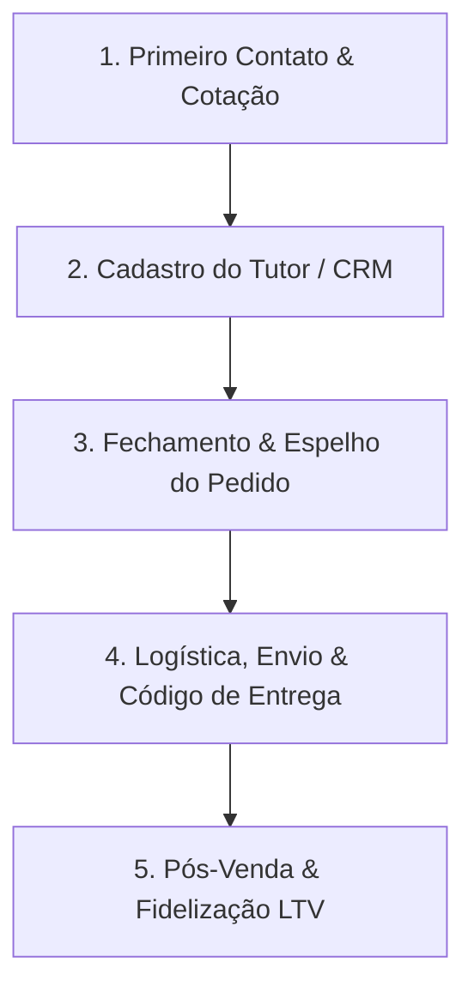

# Playbook Comercial Otimiza FarmaVet
## Manual de Integração e Diretrizes para Atendimento (Estagiária)

Bem-vinda à equipe da **Otimiza FarmaVet**! Este manual foi criado para ajudar você a entender nosso posicionamento, nossa rotina de vendas e a forma correta de interagir com nossos dois públicos principais: os tutores de pets e os médicos veterinários. 

Nossa operação é guiada pelo conceito de **"Atendimento como Arte"**, o que significa que o relacionamento, o acolhimento e a agilidade clínica estão sempre acima de qualquer transação fria.

---

## 1. Posicionamento de Marca e Diferencial Competitivo

A Otimiza FarmaVet **não é um pet shop generalista**. Somos uma **Farmácia Veterinária Especialista e de Conveniência**. 
* **Foco em Alta Complexidade (High-Ticket):** Concentramos nossos esforços em medicamentos especiais e de alto valor (como *Librela, Cytopoint, Simparic, Apoquel*).
* **Vendas Consultivas:** Nosso grande diferencial contra grandes marketplaces (como Petz, Cobasi ou Mercado Livre) é a **atenção clínica especializada** (gratuita via WhatsApp) e a conveniência do serviço **Vet em Casa** (atendimento domiciliar).
* **Omnichannel:** Nossa comunicação deve ser consistente. O tom adotado no WhatsApp deve casar perfeitamente com o que o cliente vê no nosso Instagram, Pinterest e campanhas de e-mail.

---

## 2. Os Dois Canais de Comunicação (Tom de Voz)

Dependendo de quem está do outro lado do WhatsApp, você deve alternar o seu papel e tom de voz imediatamente.

### A. Canal B2C (Tutores de Pets)
* **A Persona:** **Aika** (a mascote da loja).
* **O Sentimento Primário:** **Afeto, Acolhimento e Cuidado**.
* **Como se comunicar:** Use uma linguagem empática, meiga e focada no bem-estar do pet. Mostre preocupação genuína com a recuperação do animal.
* **Proibições:** Nunca use termos excessivamente formais ou robóticos (como *"Prezado"*, *"Senhor"*). Substitua por mensagens calorosas.

### B. Canal B2B (Médicos Veterinários & Clínicas)
* **A Persona:** **Dr. Kyenner Oliver** (Autoridade Veterinária).
* **O Sentimento Primário:** **Autoridade, Respeito, Parceria e Ciência**.
* **Como se comunicar:** Tom técnico, direto, ágil e colaborativo. Fale a linguagem deles (termos médicos, dosagens, marcas específicas de vacinas como Nobivac, Recombitek, Rabisin).
* **Objetivo:** Facilitar a vida do veterinário parceiro, entregando rapidez nas cotações e entrega expressa para que ele possa repassar ao cliente dele com tranquilidade.

---

## 3. O Funil de Atendimento no WhatsApp

Toda venda bem-sucedida segue este fluxo de 5 etapas obrigatórias.

### Etapa 1: Primeiro Contato e Cotação
* Responda de forma ágil.
* Ao informar valores, apresente-os de forma clara e limpa.
* *Exemplo B2C:* 
  > "Oi! Temos em estoque sim. O Simparic de 10mg com 1 comprimido fica por R$ 104,50, e a caixinha com 3 comprimidos fica por R$ 269,90. Qual deles fica melhor para o seu filhote?"

### Etapa 2: Cadastro do Tutor (CRM)
Antes de faturar, envie o template abaixo para cadastrar o cliente. Explique que o cadastro serve para que o veterinário da equipe acompanhe a saúde do pet no pós-venda.

> [!TIP]
> **Template de Cadastro Tutor:**
> 
> \*Cadastro Tutor\*
> 
> \*Nome completo:\*
> \*E-mail:\*
> \*CPF:\*
> \*RG:\*
> \*Data de nascimento:\*
> \*Número de WhatsApp:\*
> \*CEP:\*
> \*Número:\*
> \*Complemento:\*
> 
> \*Nome do animalzinho:\*
> \*Idade:\*
> \*Raça:\*
> \*Sexo:\*
> \*Cor:\*
> 
> Desde já muito agradecemos pela confiança! 💜

### Etapa 3: Fechamento e Espelho do Pedido
Com os dados coletados, gere o PDF do espelho do pedido no sistema. Envie o arquivo PDF acompanhado exatamente do seguinte script:

> [!IMPORTANT]
> **Template de Fechamento (Etapa Final):**
> 
> \*Oi, estamos na etapa final.\*
> Peço por gentileza que confira o espelho do pedido.
> 
> \*Com o envio do comprovante de pagamento, entenderei que o pedido segue confirmado e tudo certo para prosseguirmos.\*
> 
> \*Seguem as informações da chave PIX:\*
> 
> 💜 \*Chave PIX:\* (31) 98793 6822
> 💜 \*Banco:\* C6 Bank
> 💜 \*Nome:\* Solução Farmacêutica
> 
> Desde já, muito obrigado pela aquisição.
> \*Tenha um ótimo dia.\*

### Etapa 4: Logística e Entrega (Frete)
* **Retirada Física:** O cliente pode buscar na loja física no endereço:
  > **Avenida Abílio Machado, 514, Sala 08 - Belo Horizonte/BH**
* **Regras de Frete:**
  * **Primeira Compra:** Sempre ofereça **Frete Grátis** como incentivo de boas-vindas.
  * **Padrão Belo Horizonte:** O frete médio é de **R$ 40,00** (ou calcule conforme distância).
  * **Nova Lima/Cidades Próximas:** Média de **R$ 30,00**.
* **Envio das Informações do Entregador:**
  Assim que despachar o pedido (seja por Uber Moto ou 99App), mande os detalhes do motorista para o cliente acompanhar e ter segurança:
  > "Seu pedido está a caminho! Estou utilizando o serviço de entrega moto. Placa do veículo: [PLACA], Motorista: [NOME]. Acompanhe a corrida em tempo real por este link: [LINK DE RASTREIO]"
* **Código de Segurança:** Sempre informe e peça o código de segurança do aplicativo antes que o entregador chegue.
* **Instruções de Recebimento:** Pergunte se há restrição de horário ou se, em caso de ausência, pode deixar com vizinhos (anote o número da casa deles).

### Etapa 5: Pós-Venda e Fidelização (LTV)
* **Follow-up de 24h:** Mande uma mensagem atenciosa perguntando se a entrega chegou direitinho e como o animalzinho reagiu ao medicamento.
* **Cronograma de Recompra (Pacientes Crônicos):** Se o pet usa medicamentos contínuos (para 30 dias), configure um lembrete para entrar em contato no **25º dia** sugerindo a reposição para evitar a interrupção do tratamento.

---

## 4. Métodos de Pagamento e Políticas Comerciais

* **Pix:** Nossa chave padrão é o telefone: `(31) 98793-6822` (Banco C6 Bank, Solução Farmacêutica).
* **Cartão de Crédito:** Aceitamos, mas **a taxa da maquininha/transação corre por conta do cliente**. Sempre avise com antecedência caso prefiram pagar no cartão.

---

## 5. Casos Práticos e Como Agir (Baseado em Situações Reais)

Abaixo estão três exemplos de interações reais extraídas do histórico de conversas do nosso WhatsApp Comercial para guiar suas decisões diárias.

### Caso 1: Objeção de Segurança (Recusa em fornecer CPF)
**O que aconteceu na conversa real:** O cliente Vander Luiz queria comprar Simparic e Rifocina. Ao receber o template de Cadastro Tutor, ele recusou fornecer seu CPF por motivos de segurança digital.
* **Como NÃO agir:** Não insista de forma fria ou diga que é "obrigatório" por sistema. Isso gera desconfiança e faz o cliente ir para a concorrência.
* **Como agir corretamente (Exemplo real de sucesso):**
  1. Demonstre empatia imediata e valide a preocupação do cliente.
  2. Explique humanamente o motivo do cadastro (nossos veterinários usam para acompanhar a saúde e evolução do pet no pós-venda).
  3. Ofereça alternativas confortáveis, como comprar fisicamente na loja e tomar um café.
  > *Fala recomendada:* "Não se preocupe, Vander! Entendo perfeitamente sua preocupação com segurança. Esses dados servem para que nossa equipe veterinária possa te dar um suporte caso Spock precise de ajuda com o remedinho. Mas fique super à vontade, vou deixar tudo pronto aqui. Se quiser passar na nossa loja amanhã na Av. Abílio Machado, 514, Sala 08, aproveitamos para tomar um café juntos!"

### Caso 2: A Urgência do Médico Veterinário
**O que aconteceu na conversa real:** A Dra. Débora (veterinária parceira) fechou sua clínica e agora compra vacinas sob demanda na Otimiza para repassar direto aos seus pacientes domiciliares. Ela enviou uma mensagem pedindo urgência: *"Preciso para agora"*.
* **Como agir corretamente:**
  1. Trate o veterinário como prioridade máxima na logística. Eles dependem do produto para atender clientes agendados.
  2. Responda imediatamente confirmando que o motoboy já está saindo.
  3. Forneça o link de rastreamento da corrida em tempo real sem que eles precisem pedir.
  4. Mostre cumplicidade e peça desculpas por quaisquer correrias. A parceria B2B é construída na confiança mútua e na agilidade.

### Caso 3: Ajustes Logísticos e de Pedido de Última Hora
**O que aconteceu na conversa real:** A cliente Stefanne Gonçalves, ao receber o espelho do pedido com vacinas e medicamentos, percebeu que o valor total estouraria seu caixa do mês. Ela solicitou retirar alguns itens (vacinas V8, V5 e Raiva) de última hora e pediu para entregar na casa de vizinhos (número 100 ou 124) caso não estivesse em casa (número 120).
* **Como agir corretamente:**
  1. Seja flexível. Refaça o PDF do espelho do pedido imediatamente com os novos itens solicitados.
  2. Mande mensagens em áudio calmas, confirmando que os ajustes foram feitos.
  3. Ao despachar o entregador, passe a instrução exata por escrito no chat: *"Avisei o entregador para ir ao número 120, mas se não tiver ninguém ele tentará nos vizinhos do 100 ou 124"*.
  4. Mantenha o acompanhamento próximo até a entrega ser concluída com sucesso.

---

## 6. Nível de Autonomia e Resolução de Conflitos

Para manter a operação ágil, você tem autonomia para tomar decisões de encantamento ao cliente sem precisar consultar o Dr. Kyenner para tudo:
* **Problemas de Entrega:** Se o entregador atrasar significativamente ou houver algum transtorno logístico, você pode **zerar a taxa de frete** ou oferecer um brinde (ex: petisco) para reverter o descontentamento.
* **Promoções Especiais:** Utilize campanhas ativas para incentivar a compra. Exemplo: compras acima de **R$ 150,00** ganham participação automática no sorteio especial (ex: Sorteio dos Namorados com prêmios de bem-estar como liberação miofascial e massagens).
* **Tabelas de Vets:** Siga rigorosamente a precificação especial com descontos para compras em lote por veterinários (como a promoção de Librela: uma ampola por R$ 380,00; duas ampolas por R$ 350,00 cada).

---
*Desejamos muito sucesso no seu trabalho! Se tiver dúvidas sobre dosagens ou termos técnicos, a equipe veterinária estará sempre disponível para te dar suporte técnico imediato.*
