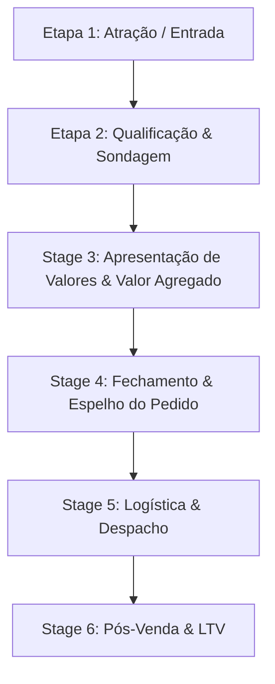

# Mapeamento do Pipeline de Conversas - Otimiza FarmaVet
## Guia de Fluxo Comercial, Triggers e Scripts Baseados em Conversas Reais

Este documento mapeia o funil de vendas real da Otimiza FarmaVet no WhatsApp, indicando como conduzir o cliente de etapa em etapa, quais mensagens enviar e as regras operacionais de transição.

---

---

## 🛠️ Detalhamento das Etapas do Funil

### Etapa 1: Atração / Entrada do Lead
O contato pode iniciar de duas formas:
1.  **Entrada Passiva:** O cliente responde a um Status da Vitrine Virtual ou entra em contato perguntando de um produto específico.
2.  **Abordagem Ativa (B2B - Lista de Transmissão):** Disparo direcionado para veterinários parceiros cadastrados.

> 📝 **Script de Disparo Ativo (B2B - Veterinários):**
> *"**Bom dia, Medvet por amor! 🫶🏾** tudo bem por aí?*
> 
> *Você chegou a ver que estamos com algumas condições especiais válidas por 24 horas?*
> 
> *Se fizer sentido pra você, me responde aqui que te envio os valores e você vê com calma o que compensa entrar no seu pedido (Vacinas, Controlados e Insumos)."*

---

### Etapa 2: Qualificação e Sondagem
**Objetivo:** Identificar se o cliente é um tutor de pet (B2C) ou médico veterinário/clínica (B2B) e mapear suas necessidades.

*   **Regra B2C (Aika - Empatia):** Solicite a receita veterinária (indispensável para medicamentos de uso restrito e Librela) e demonstre interesse no animal.
    *   *Script:* *"Boa tarde! Tudo bem por aí? Vc teria a receita dele para eu dar uma olhada e te ajudar melhor? Como o [Nome do Pet] está se sentindo?"*
*   **Regra B2B (Dr. Kyenner - Técnico):** Seja direto e ágil. Veterinários têm rotinas corridas.
    *   *Script:* *"Boa tarde, doutor(a)! Tudo bem? Me passa a lista do que você precisa cotar hoje que já puxo aqui as condições de estoque e lote!"*

---

### Etapa 3: Apresentação de Valores e Engenharia de Valor
**Objetivo:** Informar os preços agregando valor à marca (frete grátis, descontos de lote, participação em sorteios).

*   **Apresente os preços em linhas separadas e limpas.**
*   **Insira os ganchos comerciais:**
    *   *Gancho 1 (1ª compra):* Destaque o frete grátis.
    *   *Gancho 2 (Sorteio do Mês):* *"Você fechando, eu já consigo incluir você no sorteio dos dias dos namorados para compras acima de R$ 150,00!"*
    *   *Gancho 3 (Desconto de Lote):* *"O Librela fica por R$ 380,00 a ampola, mas comprando duas unidades consigo fazer R$ 350,00 cada ampola!"*

---

### Etapa 4: Fechamento (Etapa Final e Cadastro)
**Objetivo:** Coletar dados cadastrais para faturamento, emitir o PDF do Espelho do Pedido e enviar as instruções de pagamento.

*   **Ações:**
    1.  **Solicitar Cadastro:** Mande o bloco de cadastro do tutor ou pergunte o nome da clínica/nome completo (no caso de B2B).
    2.  **Enviar o Espelho do Pedido:** Gere o arquivo PDF e anexe na conversa.
    3.  **Enviar o Template de Fechamento (Etapa Final):** Esse template é padrão e não deve ser alterado.

> 📝 **Template Oficial de Fechamento (Etapa Final):**
> *"**Oi, estamos na etapa final.** 
> Peço por gentileza que confira o espelho do pedido em anexo.*
> 
> *Com o envio do comprovante de pagamento, entenderei que o pedido segue confirmado e tudo certo para prosseguirmos com o envio.*
> 
> *Seguem as informações da chave PIX:*
> 
> 💜 *Chave PIX:* (31) 98793 6822
> 💜 *Banco:* C6 Bank
> 💜 *Nome:* Solução Farmacêutica
> 
> *Desde já, muito obrigado pela aquisição.*
> *Tenha um ótimo dia!"*

---

### Etapa 5: Logística e Despacho
**Objetivo:** Confirmar o pagamento, chamar o entregador (Uber Moto/99App) e manter o cliente tranquilo.

*   **Ações:**
    1.  Receba o comprovante e valide o favorecido (**Solução Farmacêutica**).
    2.  Confirme se há restrições de horários ou locais especiais de entrega (vizinho se não estiver, portaria).
    3.  Chame a entrega e envie os dados ao cliente imediatamente:

> 📝 **Template de Envio (Rastreio):**
> *"Seu pedido já foi despachado! Estou utilizando o serviço de entrega moto.*
> 
> 🛵 *Placa da moto:* **[INSIRA A PLACA]**
> 👤 *Motorista:* **[NOME DO MOTORISTA]**
> 🔑 *Código de Segurança:* **[PIN DO APLICATIVO]**
> 
> *Você pode acompanhar a corrida em tempo real por este link:* **[LINK DE RASTREIO]**
> 
> *Por favor, informe a pessoa que irá receber sobre o código de segurança para liberar a entrega."*

---

### Etapa 6: Pós-Venda e LTV (Fidelização)
**Objetivo:** Garantir a satisfação do cliente e preparar o terreno para a próxima compra.

*   **Follow-up 24h (Aika - Cuidado):** *"Oi, bom dia! Passando para saber se deu tudo certo com a entrega ontem e se o [Nome do Pet] tomou o remedinho tranquilo? Se precisar de alguma dica, estamos aqui! 💜"*
*   **Régua de Recompra (Medicamentos de Uso Contínuo - LTV):**
    *   Cadastre a data da compra. Se o medicamento é para 30 dias (ex: Apoquel, Cytopoint, Librela), configure um lembrete no celular ou sistema para entrar em contato no **25º dia**.
    *   *Script da Aika:* *"Oi! O tratamento de uso contínuo do [Nome do Pet] deve estar terminando nos próximos dias. Como a entrega das distribuidoras às vezes demora, quer que eu já garanta a próxima ampola dele no nosso estoque para o tratamento não ser interrompido? Posso agendar a entrega para a data que ficar melhor para você!"*

---

## ⚠️ Regras Operacionais de Transição de Etapa

1.  **Não pule a qualificação:** Nunca envie orçamento para um tutor sem entender a receita e qual o pet, e nunca mande o Pix sem enviar o PDF do Espelho do Pedido correspondente.
2.  **Alerta de Segurança (Transbordamento Humano):** Se um veterinário parceiro pedir um produto urgente (ex: *"Preciso de 3 vacinas V10 para agora, meu cliente já está na recepção"*), a estagiária deve interromper qualquer tarefa secundária, acionar a logística imediatamente e responder no chat com a placa do motorista em menos de 10 minutos.
3.  **Segurança do Faturamento:** Nunca libere a moto ou a retirada física na loja antes de receber e anexar o comprovante de pagamento no sistema.
